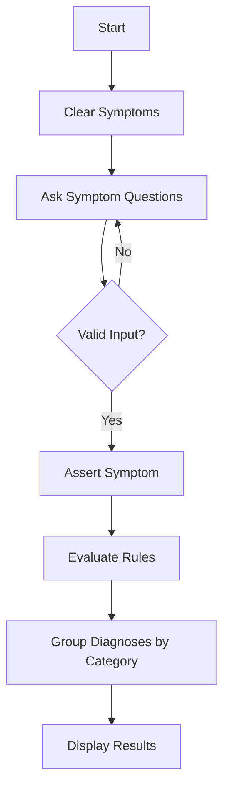

# Car Diagnosis Expert System 🚗💡

A **rule-based expert system** developed in Prolog to diagnose common car issues. The system interacts with users via symptom-based questions, applies logical inference, and provides categorized diagnoses with explanations—simulating a mechanic's diagnostic reasoning.

---

## 🏫 Project Overview  
**University**: Benha University, Faculty of Engineering (Shoubra)  
**Department**: Communications and Computer Engineering  
**Course**: Artificial Intelligence (CCE414)  
**Supervisor**: Dr. Mohamed Rehan  

**Purpose**:  
- Assist car owners in identifying issues before consulting a professional.  
- Demonstrate Prolog’s backward chaining for rule-based expert systems.  

**Key Components**:  
- **Symptom Collection**: Dynamic question flow with conditional skipping.  
- **Diagnosis Rules**: 23+ IF-THEN rules covering electrical, fuel, cooling, and exhaust systems.  
- **User-Friendly Output**: Grouped diagnoses with explanations.  

---

## ⚙️ Features  
✅ **Interactive Q&A**  
   - Plain English questions (e.g., *"Is the ignition turning on?"*).  
   - Input validation (`yes/no` only).  
   - Skips irrelevant questions based on prior answers.  

✅ **Logical Inference**  
   - Backward chaining to trace symptoms to diagnoses.  
   - Layered rules (e.g., `check_battery → charge_battery → replace_battery`).  

✅ **Structured Output**  
   - Diagnoses grouped by car system (electrical, cooling, etc.).  
   - Explanations for each diagnosis (e.g., *"Blue smoke indicates oil leakage"*).  

✅ **Extensible Design**  
   - Easy to add new symptoms, rules, or categories.  

---

## 🏗 System Architecture  


1. **Symptom Collection**:  
   - Dynamically asserts user responses as Prolog facts (`symptom(X)`).  
2. **Rule Engine**:  
   - 23+ rules like:  
     ```prolog
     diagnosis(clean_and_tighten_battery_terminals) :- 
         symptom(ignition_on), symptom(engine_fails_to_crank).
     ```
3. **Output Module**:  
   - Formats results with bullet points and category headers.  

---

## 💻 Installation & Usage  
### Requirements  
- **SWI-Prolog** ([Download here](https://www.swi-prolog.org/)).  

### Steps  
1. Clone the repository:  
   ```bash
   git clone https://github.com/your-repo/car-diagnosis-expert-system.git
   ```
2. Navigate to the project directory and launch Prolog:  
   ```bash
   swipl Car_Diagnosis_Expert_System.pl
   ```
3. Run the diagnosis:  
   ```prolog
   ?- run_diagnosis.
   ```
4. Answer `yes`/`no` to the interactive questions.  

### Example Output  
```plaintext
--- Grouped Diagnoses ---

ELECTRICAL SYSTEM ISSUES
• Diagnosis: clean_and_tighten_battery_terminals
  → "The battery terminals may be dirty or loose."

COOLING SYSTEM ISSUES
• Diagnosis: check_radiator_water_and_fan
  → "Cooling system should be checked for water level."
```

---

## 👩‍💻 Team Members  
- Nourhan Farag Mohamed 
- Razan Ahmed Fawzy
- Malak Mounier Abdellatif 
- Farida Waheed Abdelbary
- Nour Hesham Elsayed  

---

## 📜 Poster


---

## 📚 Resources  
- [Full Report](Cardiagnosis_Expertsystem_Ai_project2_report.pdf)  
- [Presentation Slides](Cardiagnosis_Expertsystem_Ai_project2_presentation.pptx)  
- [Poster](Cardiagnosis_Expertsystem_Ai_project2_poster.pdf)  

